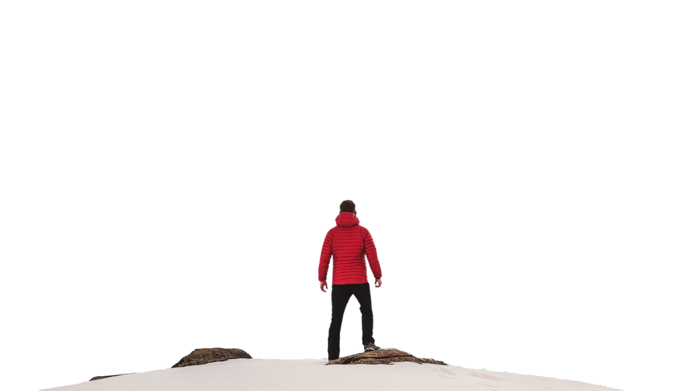

# 🏞️ Adventure Parallax Web Page

This project is a visually engaging parallax scrolling web page built using **HTML** and **CSS**, showcasing different adventure activities such as **Biking**, **Paragliding**, and **Surfing** with stunning background visuals.

## 🌟 Features

- Immersive **parallax scrolling** using `perspective` and `transform`
- Fixed background image sections with descriptive overlay text
- Large, bold heading with text shadows for emphasis
- Responsive flexbox layout for central content
- Smooth 3D depth effects

## 🚀 How to Run

1. Clone the repository:
   ```bash
   git clone https://github.com/Ayushcs23/CSS-Projects.git
Navigate to the project directory and make sure the following files exist:

index.html

Style.css

image.png, background.jpeg

sport-1.jpg, photo2.jpg, sport-3.jpg

Open index.html in your browser.

📁 Project Structure
arduino
Copy
Edit
CSS-Projects/
├── index.html
├── Style.css
├── image.png
├── background.jpeg
├── sport-1.jpg
├── photo2.jpg
└── sport-3.jpg
🧠 CSS Concepts & Properties Used
This project makes use of the following advanced and foundational CSS concepts:

📐 Layout & Structure
display: flex

align-items, justify-content

position: relative/absolute

z-index

🎨 Visual Styling
object-fit: cover

text-shadow

letter-spacing

font-size, color

🌀 Effects & Animation
transform: translateZ(), scale()

transform-style: preserve-3d

perspective, perspective-origin

background-attachment: fixed

background-position, background-size

transition (for smooth changes)

📱 Responsive Design
viewport units (vh, rem, %)

Author
Ayush Shukla
🔗 GitHub Profile

Feel free to fork this repo, suggest improvements, or use the layout for your own creative projects!

php-template
Copy
Edit

---

📌 **Note**: Make sure to correct the class typo in your HTML:
```html
  <!-- should be "foregroundimage" -->
